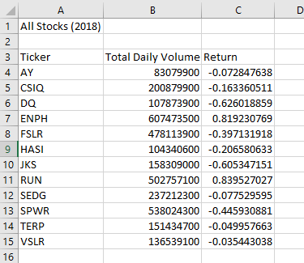
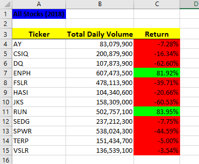
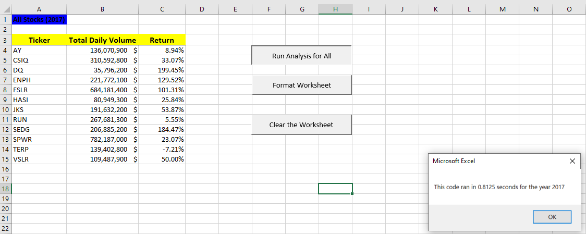

# Stock-analysis
In this project, we will explore green energy stock performance by analyzing financial data using VBA.

## Background

Green energy investments are very popular especially as the world increasingly moves toward a clean energy future.  
Many investors believe that as fossil fuels get used up, there will be more and more reliance on alternative energy production.  

There are many forms of green energy to invest in, including hydroelectricity, wind energy, geothermal energy, and bioenergy. 
However, our clients are decided to invest all their money into DAQO New Energy Corporation, a company that makes silicon wafers for solar panels.  

Out of concern about diversifying their funds, they have requested an analysis of other green energy stocks, in addition to DAQO’s stock. 

The green energy stock data is provided to us by a financial advisor as an Excel file.
We will be using an extension to Excel built to automate tasks: Visual Basic for Applications, usually referred to as just VBA. 

VBA is a programming language that interacts with Excel. It can read and write to cells and worksheets, make calculations, and use complex logic to perform analyses. 
Using code to automate analyses, allows us to reuse it with any stock and reduces the chance of accidents and errors. 

### Purpose
Determine which green energy stock is a better investment for our clients. 

## Objectives
1. Find the total daily volume and yearly return for the DAQO stock.
2. Find the total daily volume and yearly return for all green energy stocks.
3. Add formatting to the results worksheets. 
4. Create **Buttons** to easily run analysis and other functions.
5. Update the code to run the stock analysis for each year in the workbook. 

## Resources
- Data Sources: green_stocks.xlsx, green_stocks.xlsm
- Software: Microsoft Excel
- Libraries & Packages: Visual Basic for Applications (VBA)
- Online Tools: [Stocks_Analysis_VBA GitHub Repository](https://github.com/Magzzie/Stocks_Analysis_VBA)

## Methods & Code
Visual Basic for Applications, which is typically referred to as "VBA," is often used in the finance industry.
VBA provides essentially infinite extensibility to Excel. Using code to automate tasks decreases the chance of errors and reduces the time needed to run analyses, 
especially if they need to be done repeatedly. 

- We Calculated the total daily trading volumn of the DAQU stock using conditionals and a for loop to go through all the rows with the ticker DQ and add the daily volumn, 
then export the sum to a cell in a different sheet (DQ Analysis worksheet) using the right sheet activation command. 
- We calculated the difference between the starting price and ending price of DQ stock in 2018 using conditionals inside a for loop through all the rows with the DQ ticker in the first cell. 
- To run analysis on all of the stocks, we needed to create a program flow that loops through all of the tickers.
- We created a new workbook sheet to hold the analysis of all stocks then we constructed a subroutine for formatting and calculations. 
	- First, we formatted the output sheet on the "All Stocks Analysis" worksheet
	- Second, we initialized an array of all tickers.
	- Third, we formulated the analysis plan, initialized variables for the starting price and ending price, activated the data worksheet, and got the number of rows to loop over. 
	- Fourth, we established a for loop to go through the tickers because before we get to the inner loop, we need to consider any values that need to be initialized before the inner loop starts.  
	Every time we finish analysis on one ticker, we need to reset the total volume to zero.   This means the line totalVolume = 0 is inside the ticker loop, but outside of the row loop.
	- Fifth, we established an inner for loop to go through the rows in the data and calcuate the values.  
		Step 5 consists of three parts that can be accomplished with the code previously used for DQ calculations but with minor adjustments:  
		- Find the total volume for the current ticker.
		- Find the starting price for the current ticker.
		- Find the ending price for the current ticker.
	- Sixth, we output the data for the current ticker to a new row so we need to slightly alter the code from before so that the output for each ticker prints on a new row. This is a case where using Cells() is much easier than using Range().
- Next, we applied some formatting to the results worksheets to make it easier to read. We constructed a new macro and wrote code to change font styles, add borders, and set number formats among other things. 
- Furthermore, we used conditional formatting to change the color of the cell based on its value.
- We inserted buttons and assigned them to analysis macros on different sheets of the workbook. 
- We wanted to add interactivity to our macros; specifically, to allow the user to input the desired year for the analysis.  
	- To get the user's input, we used the InputBox() command. 
	- InputBox works like MsgBox but contains a text box to get input from the user.
	- We also reassigned the Buttons to the year-based macro for the question window to pop up whenever the user clicks the button. 
	- The formatting will reset the coloring with the changing of analysis year once the formatting button is clicked. 

## Results
- Total number of records is 3,013 for 12 green energy stocks for each of the years 2017 and 2018.
- The records shows the ticker for each stock, date, daily opening, high, low, closing, and adjusted closing values in addition to the daily volume traded. 
- Daily volume is the total number of shares traded throughout the day; it measures how actively a stock is traded. 
- The yearly return is the percentage difference in price from the beginning of the year to the end of the year.
- We studied the daily volumn and yearly return of the DAQO Stock first. 
- The total daily volume of DQ stock is shown in the "DQ Analysis" worksheet: DQ traded 107,873,900 shares in 2018.
- Upon calculating the difference between the ending price and starting price of trading for the DQ stock we found that Daqo dropped over 63% in 2018. 
- Therefore, we started looking into other stocks that might be a better green energy investment. 
- We repurposed the code used to calcluate the total daily volume and yearly return of the DQ stock to calculate these for all green energy stocks and collected the results in a new worksheet. 
- Here is what the results were for all green energy stocks:   

	||
	|-|
- Adding formatting to the worksheet tables makes it easier to read and understand at a glance.  
	As such, we applied text and color formatting to the All Stock Analysis worksheet so that positive returns were green and negative returns red.  
	This was feasible by looping through each of the returns, and if the return was positive, we made the background color green; if the return was negative, we made the background red; otherwise, we cleared the background color.
	
	||
	|-|
- To simplify the analysis process for the end-users of our code, we created buttons in the worksheet.  
	Now any user of the .xlsm code can run the previous calculations for all stocks with the click of a button in the same worksheet.
- We have also inserted buttons to clear the analysis on any specific sheets to allow the user to recreate the analysis results for each sheet separately. 
- We created a user-friendly analysis macro that will take the input of the user about the desired year and apply the analysis on all stocks values from that year. 
- The results will display on the All Stock Analysis sheet with the right year of choice displayed at the top. 
- We timed the performance of the basic code we had built thus far and recorded the output. 
	- The first run of the analysis code for the year 2017 took 0.8125 seconds.
	- The first run of the analysis code for the year 2018 took 0.8125 seconds.  
	
	||
	|-|
	|![All Stocks Analysis - 2018 - Timed.}(./Resources/all_stocks_returns_2018_time.png)|

## Recommendations

---

