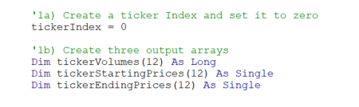
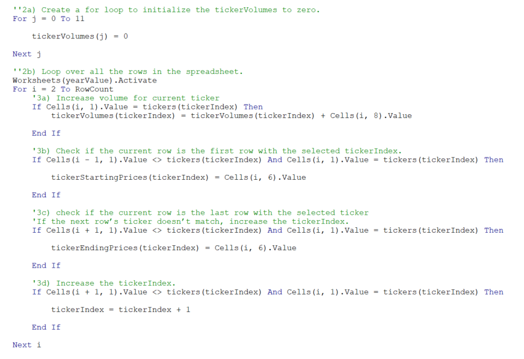
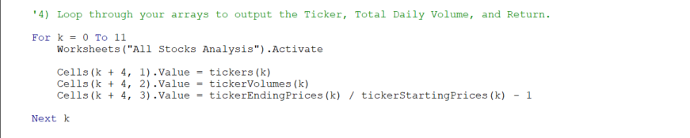
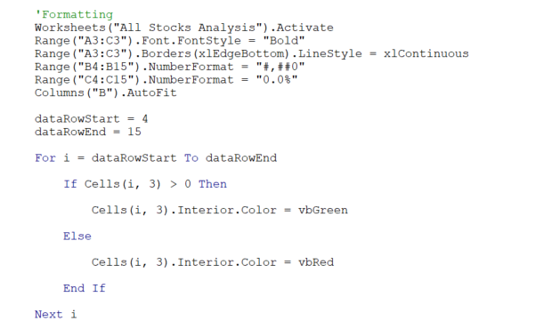
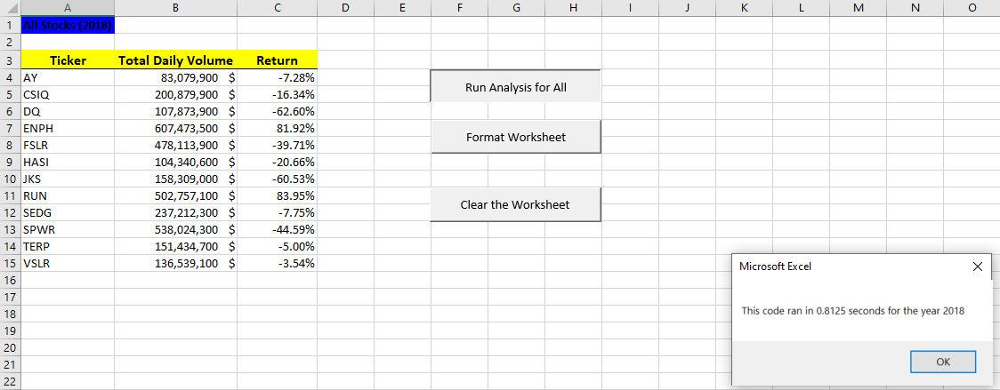
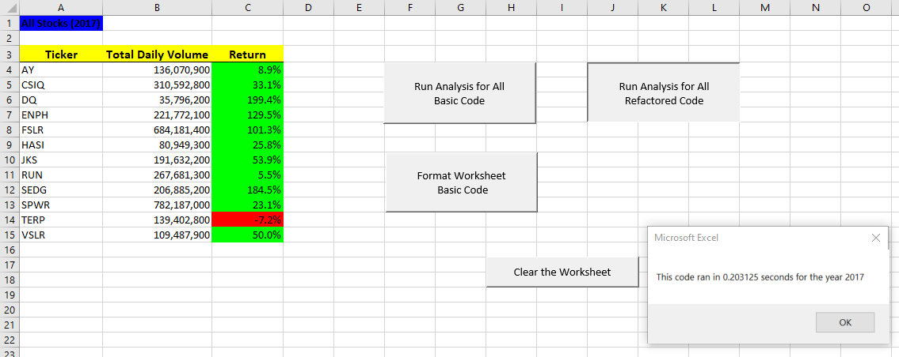
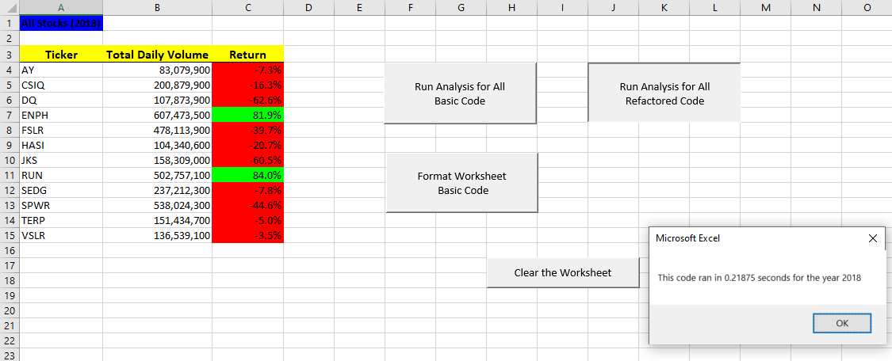
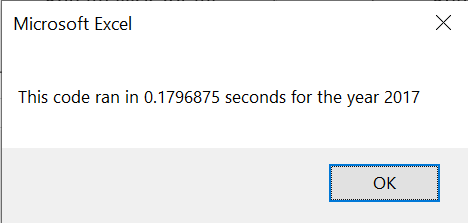
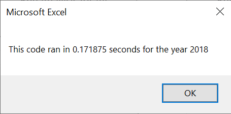

# Stock-analysis
This project will explore green energy stock performance by analyzing financial data using VBA.

## Background

Green energy investments are trendy, especially as the world increasingly moves toward a clean energy future.  
Many investors believe that as fossil fuels get used up, there will be more and more reliance on alternative energy production.  

There are many forms of green energy to invest in, including hydroelectricity, wind energy, geothermal energy, and bioenergy. 
However, our clients are decided to invest all their money into DAQO New Energy Corporation, a company that makes silicon wafers for solar panels.  

Out of concern about diversifying their funds, they have requested an analysis of other green energy stocks in addition to DAQO's stock. 

The green energy stock data is provided to us by a financial advisor as an Excel file.
We will be using an extension to Excel built to automate tasks: Visual Basic for Applications usually referred to as just VBA. 

VBA is a programming language that interacts with Excel. It can read and write to cells and worksheets, make calculations, and use complex logic to perform analyses. 
Using code to automate analyses allows us to reuse it with any stock and reduces the chance of accidents and errors. 

### Purpose
Determine which green energy stock is a better investment for our clients.  
Additionally, we intend to build a robust code that can analyze thousands of stocks if the dataset is expanded in the feature. 

## Objectives
1. Find the total daily volume and yearly return for the DAQO stock.
2. Find the total daily volume and yearly return for all green energy stocks.
3. Add formatting to the results worksheets. 
4. Create **Buttons** to run analysis and other functions easily.
5. Update the code to run the stock analysis for each year in the workbook. 
6. Create a timer to assess the performance of the basic analysis code. 
7. Refactor the code to loop through all the data one time. 
8. Determine whether refactoring the code successfully made the VBA script run faster. 

## Resources
- Data Sources: green_stocks.xlsx, green_stocks.xlsm
- Software: Microsoft Excel
- Libraries & Packages: Visual Basic for Applications (VBA)
- Online Tools: [Stocks_Analysis_VBA GitHub Repository](https://github.com/Magzzie/Stocks_Analysis_VBA)

## Methods & Code
Visual Basic for Applications typically referred to as "VBA," is often used in the finance industry.
VBA provides essentially infinite extensibility to Excel. In addition, using code to automate tasks decreases the chance of errors and reduces the time needed to run analyses, 
especially if they must be done repeatedly. 

- We Calculated the total daily trading volume of the DAQU stock using conditionals and a for loop to go through all the rows with the ticker DQ and add the daily volume, 
then export the sum to a cell in a different sheet (DQ Analysis worksheet) using the correct sheet activation command. 
- We calculated the difference between the starting price and ending price of DQ stock in 2018 using conditionals inside a for loop through all the rows with the DQ ticker in the first cell. 
- To run an analysis on all stocks, we needed to create a program flow that loops through all the tickers.
- We created a new workbook sheet to hold the analysis of all stocks then we constructed a subroutine for formatting and calculations. 
	- First, we formatted the output sheet on the "All Stocks Analysis" worksheet
	- Second, we initialized an array of all tickers.
	- Third, we formulated the analysis plan, initialized variables for the starting and ending price, activated the data worksheet, and got the number of rows to loop over. 
	- Fourth, we established a for loop to go through the tickers because before we get to the inner loop, we need to consider any values that need to be initialized before the inner loop starts.  
	Every time we finish analysis on one ticker, we need to reset the total volume to zero.   This means the line totalVolume = 0 is inside the ticker loop but outside the row loop.
	- Fifth, we established an inner for loop to go through the rows in the data and calculate the values.  
		Step 5 consists of three parts that can be accomplished with the code previously used for DQ calculations but with minor adjustments:  
		- Find the total volume for the current ticker.
		- Find the starting price for the current ticker.
		- Find the ending price for the current ticker.
	- Sixth, we output the data for the current ticker to a new row, so we need to slightly alter the code from before so that the output for each ticker prints on a new row. This is a case where using Cells() is much easier than using Range().
- Next, we applied some formatting to the results worksheets to make them easier to read. Then, we constructed a new macro and wrote code to change font styles, add borders, and set number formats. 
- Furthermore, we used conditional formatting to change the color of the cell based on its value.
- We inserted buttons and assigned them to analyze macros on different workbook sheets. 
- We wanted to add interactivity to our macros to allow the user to input the desired year for the analysis.  
	- To get the user's input, we used the InputBox() command. 
	- InputBox works like MsgBox but contains a text box to get input from the user.
	- We also reassigned the Buttons to the year-based macro for the question window to pop up whenever the user clicks the button. 
	- Once the formatting button is clicked, the results coloring will reset according to the analysis year. 
- We created a timer that will deduct the difference between timing variables and return the elapsed time for the loop executing in between for each year.  
The timing results will show in a message box for each analysis run. 
- To enhance the performance of our code, we refactored the previous analysis code: 
	- First, we defined a ticker index and three output arrays to store the calculated values.  

	|| 
	|-|
	
	- Next, we restructured the loops separately so that the calculations' loop is separate from the output loop, with the latter using the values stored in the arrays during the last loop, in addition to using the ticker index for reference in all calculations. 
	
	|| 
	|-|
	||

	- We also add formatting code to the same subroutine to merge steps of output for the user instead of clicking two buttons to get the desired view of the results. 
	
	||
	|-|

- Finally, we inserted another button that can execute the refactored code without accessing the developer tools. 

## Results
- The total number of records was 3,013 for 12 green energy stocks for 2017 and 2018 each.
- The records show the ticker for each stock, date, daily opening, high, low, closing, and adjusted closing values in addition to the daily volume traded. 
- Daily volume is the total number of shares traded throughout the day; it measures how actively a stock is traded. 
- The yearly return is the percentage difference in price from the beginning to the end of the year.
- We first studied the daily volume and yearly return of the DAQO Stock. 
- The total daily volume of DQ stock is shown in the "DQ Analysis" worksheet: DQ traded 107,873,900 shares in 2018.
- Upon calculating the difference between the ending price and starting price of trading for the DQ stock, we found that Daqo dropped over 63% in 2018. 
We started looking into other stocks that might be a better green energy investment. 
- We repurposed the code used to calculate the total daily volume and yearly return of the DQ stock to calculate these for all green energy stocks and collected the results in a new worksheet. 
- Here is what the results were for all green energy stocks:   

	||
	|-|
- Adding formatting to the worksheet tables makes it easier to read and understand at a glance.  
	As such, we applied text and color formatting to the All Stock Analysis worksheet so that positive returns were green and negative returns red.  
	This was feasible by looping through each of the returns, and if the return was positive, we made the background color green; if the return was negative, we made the background red; otherwise, we cleared the background color.
	
	||
	|-|
- To simplify the analysis process for the end-users of our code, we created buttons in the worksheet.  
	By doing so, any finance client can run previous calculations on all stocks in the dataset with the click of a button.
- We have also inserted buttons to clear the analysis on any specific sheets, allowing the user to recreate the analysis results for each sheet separately. 
- We created a user-friendly analysis macro that will take the user's input about the desired year and apply the analysis to all stock values from that year. 
- The results will display on the All Stock Analysis sheet, with the correct year of choice displayed at the top. 
- We timed the performance of the basic code we had built thus far and captured the output. 
	- The first run of the analysis code for the year 2017 took 0.8125 seconds.
	- The first run of the analysis code for 2018 took 0.8125 seconds.  
	
	||
	|-|
	||
- We intend to expand the dataset to include the entire stock market over the last few years.  
Although our code worked well for a dozen stocks, it might not work well for thousands of stocks.  
And if it does, it may take a long time to execute.
- Therefore, we refactored the code to loop through all the data once to collect the same information collected with the earlier code. 
- Refactoring is a vital part of the coding process. When refactoring code, we are not adding new functionality; we want to make the code more efficient  
	—by taking fewer steps, using less memory, or improving the logic of the code to make it easier for future users to read.
- By using separate loops for calculations and results output, the analysis performance was much faster even though formatting was included in the same subroutine. 
- We timed the performance of the refactored code and captured the output. 
	- The first run of the refactored analysis code for 2017 took 0.203125 seconds.
	- The first run of the refactored analysis code for 2018 took 0.21875 seconds.  
	
	||
	|-|
	||
	
- Repeated runs of the code decreased the run time even further. 

	|||
	|-|-|
	
## Recommendations
1. There was a significant difference in the performance of green energy stocks between 2017 and 2018. 
2. All the stocks except one (TERP) traded positively over 2017, while most lost value in 2018. 
3. DAQO stock was on top of the list for yearly returns among other green energy stocks and nearly doubled in value. 
4. However, the DAQO stock lost more than 60% of its value in 2018, moving to the bottom of the list of green energy investments. 
5. Hence, we conclude that DAQO is not the best green energy stock for investment.
6. In 2018, two stocks gained more than 80% in value: RUN and ENPH.
7. During the execution of the basic code, we encountered a slightly higher runtime averaging around 0.8 seconds.
5. Refactoring our analysis code and structuring different loops to get the calculations done tremendously decreased the time required to run the code on all stocks for one year. 
6. The decrease in runtime with the refactored code to 0.2 seconds on average was a significant advantage for both users and analysts.
7. Another added benefit of the refactoring is the ability to use the stored values from the initial loop for other p
There were certain disadvantages to refactoring the code, including but not limited to the sophisticated engineering of the for loops and the repeated attempts to debug the code and execute it successfully. 
8. Overall, refactoring the VBA analysis code adds proficiency to programming and enhances the order of code. 

---

